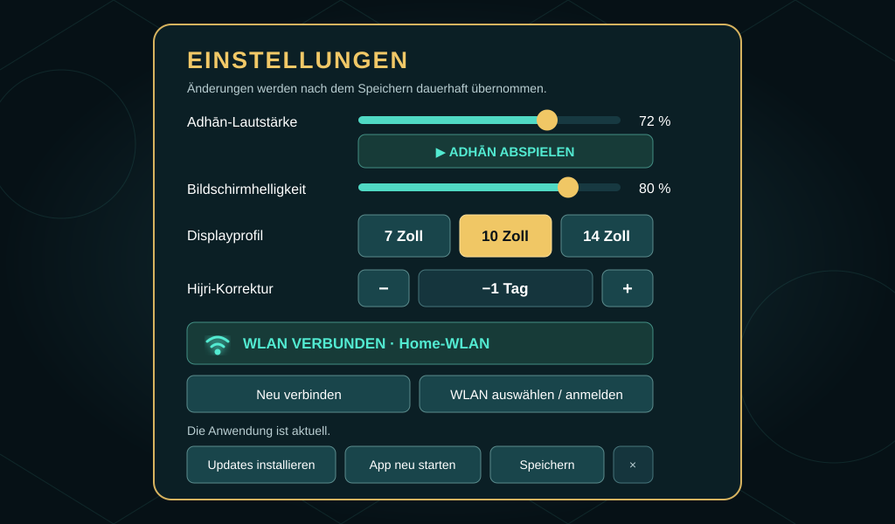
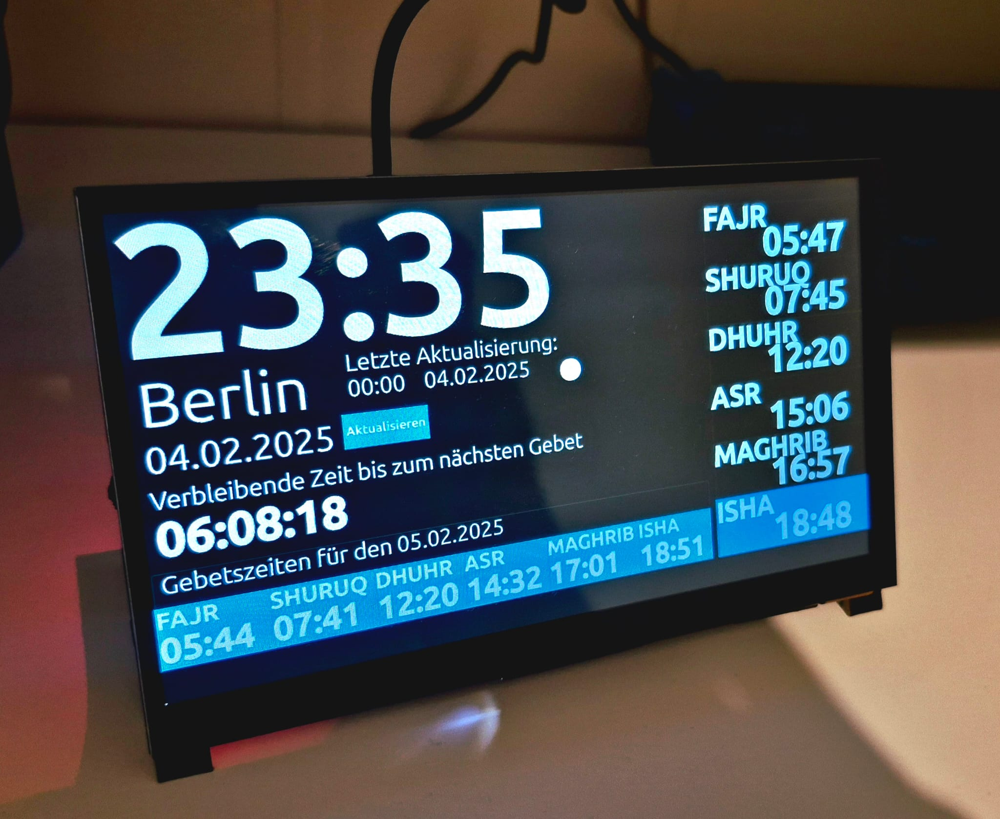

# PrayerTimeClock

Eine touchoptimierte Gebetszeituhr für den Raspberry Pi. Die Anwendung zeigt die
Gebetszeiten für Berlin im Vollbild, lädt die Daten von Diyanet, spielt zum
Gebetseintritt den passenden Adhān und arbeitet bei Netz- oder
Diyanet-Ausfällen mit einem datumsscharfen 7-Tage-Fallback weiter.



## Funktionsumfang

### Hauptansicht

- Aktuelle Uhrzeit, deutsches Datum und Standort Berlin
- Gebetszeiten für heute und morgen
- Countdown bis zum nächsten Gebet
- Hervorhebung des aktuell eingetretenen Gebets
- Berechnung und Anzeige der islamischen Mitternacht
- Hijri-Datum mit Hinweisen auf besondere islamische Tage und Monate
- Hinweise auf empfohlene Fastentage, unter anderem montags, donnerstags und
  an den weißen Tagen
- Zusammenführung überschneidender Hinweise: „Fasten empfohlen“ erscheint
  nicht doppelt
- Jumuʿah wird freitags im Heute-Bereich und bereits donnerstags im
  Morgen-Bereich angekündigt
- Ruhige Türkis-/Gold-Partikel bewegen sich ausschließlich im linken
  Hauptbereich hinter den Texten
- Animiertes islamisches Ornament
- Datum und Uhrzeit der letzten erfolgreichen Datenaktualisierung
- WLAN-Symbol in der Hauptansicht: grün verbunden, rot und durchgestrichen
  getrennt

### Adhān

- Automatische Wiedergabe ausschließlich beim Eintritt einer tatsächlichen
  Gebetszeit
- Eigene Fajr-Aufnahme mit „aṣ-ṣalātu ḫayrun mina n-naum“
- Normaler Adhān für Dhuhr, ʿAṣr, Maghrib und ʿIschāʾ
- Keine Audioausgabe für Schurūq
- Blinkende Markierung des Gebets während der Wiedergabe
- Das Ornament reagiert synchron auf den tatsächlichen Lautstärkeverlauf der
  jeweiligen Adhān-Aufnahme: ruhige Passagen bewegen die Ringe sanft,
  kräftige Passagen vergrößern und erhellen sie stärker
- Die Partikel folgen demselben geglätteten Profil: kräftige Passagen lassen
  sie stärker auf und ab glühen und blenden behutsam zusätzliche Lichtpunkte
  ein; in ruhigen Passagen kehren sie weich zum Standardzustand zurück
- Vorab geglättete 100-ms-Profile für normalen und Fajr-Adhān verhindern
  willkürliche oder hektische Ausschläge und entlasten den Raspberry Pi
- Fehlt ein Analyseprofil, läuft sicher die normale Ornamentanimation weiter
- Einstellbare Lautstärke mit sofort hörbarer Änderung
- Testfunktion „Adhān abspielen“, die während der Wiedergabe zu
  „Adhān stoppen“ wechselt

Weitere Hinweise zu den Audiodateien stehen in [AUDIO_SETUP.md](AUDIO_SETUP.md).

### Touch-Einstellungen



- Große Touch-Schaltflächen für die Displayprofile 7, 10 und 14 Zoll
- Live-Regler für Adhān-Lautstärke und Bildschirmhelligkeit
- Kompaktes Zwei-Spalten-Layout ohne notwendiges Scrollen auf dem
  1024×600-Display
- Mini-Live-Vorschau aus exakt demselben Ornament und derselben
  Partikelkomponente wie in der Hauptansicht
- Getrennte Regler für normales Ornamenttempo und normales Partikeltempo
- Getrennte Regler für die sichtbare Adhān-Reaktionsstärke von Ornament und
  Partikeln; der geglättete, aufnahmesynchrone Verlauf bleibt erhalten
- Hijri-Korrektur von −2 bis +2 Tagen über separate `−`- und `+`-Tasten
- WLAN-Status einschließlich Name des verbundenen Netzes
- „Neu verbinden“ und „WLAN auswählen / anmelden“
- Updateprüfung, Installation, App-Neustart und App-Beenden

Die Helligkeitssteuerung verwendet zuerst `brightnessctl`, danach ein
vorhandenes Linux-Backlight-Gerät. Unterstützt ein HDMI-Display keine
Hardwaresteuerung, dimmt die Anwendung die Oberfläche softwareseitig ab.

## Visuelle Zustände

Für jeden relevanten Anwendungszustand gibt es eine eigene SVG-Vorschau. Die
Grafiken sind Beispiele; Datum, Uhrzeit, Gebetszeiten und Hinweise werden in
der Anwendung dynamisch erzeugt.

| Zustand | Darstellung | Vorschau |
| --- | --- | --- |
| Aktuelle Online-Daten | `AKTUELL`, Türkis-/Gold-Partikel und Standardornament | [SVG öffnen](prayerclock-preview-v25-monday-thursday-fasting-dedup.svg) |
| Exakt datierter Cache | `GESPEICHERT` und tatsächlich verbleibende Fallback-Reichweite | [SVG öffnen](prayerclock-cached-state-preview.svg) |
| Kein gültiger Fallback | `VERALTET`, rote Statusfarben und echtes rotes Ornament | [SVG öffnen](prayerclock-fallback-warning-preview.svg) |
| Besonderer islamischer Höhepunkt | deutlich kräftigere Gold-/Weiß-Partikel und Festtagspalette | [SVG öffnen](prayerclock-celebration-state-preview.svg) |
| Laufender Adhān | aufnahme-synchrone Ringausdehnung sowie intensiveres Partikelglühen | [SVG öffnen](prayerclock-adhan-state-preview.svg) |
| Touch-Einstellungen | Display-, Audio-, Helligkeits-, WLAN- und Updateoptionen | [SVG öffnen](prayerclock-settings-preview.svg) |

### Partikel und besondere islamische Tage

Die Standardpartikel verwenden die ruhige Türkis-/Gold-Palette des Designs.
An seltenen, besonders hervorgehobenen Tagen und Nächten wird automatisch eine
hellere Gold-/Weiß-Palette mit mehr und stärker leuchtenden Partikeln
verwendet. Aktuell gilt dies für:

- ʿĪd al-Fiṭr und ʿĪd al-Aḍḥā
- ʿArafah und ʿĀschūrāʾ
- den Beginn Ramaḍāns
- die ungeraden Nächte der letzten zehn Ramaḍān-Nächte
- die ersten zehn Tage von Dhū l-Ḥiddscha

Jumuʿah und andere wichtige Hinweise werden sichtbar gekennzeichnet, lösen
aber nicht automatisch den seltenen Festtagslook aus. Ein kritischer
Fallback-Zustand hat immer Vorrang: Das rote Ornament wird auch an einem
Festtag niemals durch Gold und Weiß überdeckt.

## Datenstatus und 7-Tage-Fallback

Bei jeder erfolgreichen Aktualisierung liest die Anwendung Diyanet-Daten für
heute und die nächsten sieben Tage ein und speichert sie lokal. Jeder Eintrag
ist an ein vollständiges Datum gebunden. Ein alter Montag kann deshalb niemals
als Fallback für einen späteren Montag verwendet werden.

| Anzeige | Bedeutung |
| --- | --- |
| `AKTUELL` | Die heutigen Daten wurden erfolgreich von Diyanet geladen. |
| `GESPEICHERT` | Die Zeiten stammen aus dem lokalen, exakt datierten Fallback. |
| `VERALTET` | Für das benötigte Datum liegen keine gültigen Zeiten vor. |
| `Fallback noch X Tage verfügbar` | So viele lückenlos gespeicherte Tage sind tatsächlich noch nutzbar. |
| `Fallback endet heute` | Nur der heutige Tag ist noch vollständig verfügbar. |
| `Kein Fallback verfügbar` | Es gibt keinen passenden Cache-Eintrag mehr. |

Die Restreichweite wird aus den wirklich vorhandenen Tagen berechnet. Eine
Lücke im Cache wird nicht übersprungen. Nach einem Datumswechsel schaltet die
Uhr nur auf den Eintrag des exakten neuen Datums um; fehlt dieser, werden keine
alten Zeiten als gültig ausgegeben.

Nach sieben vollständigen Tagen ohne erfolgreiche Aktualisierung und ohne
gültige heutige Zeiten wechselt das Ornament auf eine eigene rote Farbpalette.
Es handelt sich nicht um einen transparenten Rotfilter: Konturen, Flächen,
Gürtel und Mittelpunkt werden im Warnzustand neu gerendert. Die
Fallback-Reichweite bleibt kompakt in der oberen Aktualisierungsleiste.



### Verhalten bei Fehlern

- Die Anwendung startet auch ohne Internet mit lokal gespeicherten Daten.
- Beim Start wartet `startup.sh` höchstens 60 Sekunden auf Internet.
- Nach einem fehlgeschlagenen Abruf erfolgt alle fünf Minuten ein neuer
  Datenversuch.
- Der WLAN-Status wird beim Start, beim Öffnen der Einstellungen, nach einer
  Neuverbindung und danach alle 60 Sekunden über NetworkManager (`nmcli`)
  geprüft. Es wird dafür kein externer Server angepingt.
- Ein Wechsel zu einem anderen, in Raspberry Pi OS gespeicherten WLAN erfordert
  keine Änderung an `startup.sh`.

## Sichere Anwendungsupdates

Updates werden innerhalb der Einstellungsseite installiert:

1. Die Anwendung prüft den Branch `NewClockVersion`.
2. Ein neuer Stand wird zunächst in einem temporären Verzeichnis vorbereitet.
3. Neue Einträge aus `requirements.txt` werden mit der aktiven virtuellen
   Python-Umgebung installiert.
4. Der Python-Code wird kompiliert und der neue Stand getestet.
5. Erst bei erfolgreicher Prüfung wird das Fast-Forward-Update übernommen.
6. Die laufende Anwendung bleibt geöffnet und zeigt
   `Update installiert · Neustart erforderlich`.
7. Der Nutzer startet die App bewusst über „App neu starten“ neu.

Auch nach einem manuellen `git pull` vergleicht `startup.sh` den Hash der
`requirements.txt` und installiert geänderte Python-Abhängigkeiten vor dem
Start einmalig.

## Empfohlene Hardware

- Raspberry Pi 4 Model B oder neuer
- 7-, 10- oder 14-Zoll-Touchdisplay mit HDMI-Eingang
- USB-Verbindung für Touch
- Separate stabile Stromversorgung für das Display
- Lautsprecher über HDMI oder einen vom Betriebssystem bereitgestellten
  Audioausgang

Ein 10,1-Zoll-Display mit 1920 × 1200 Pixeln funktioniert mit dem
10-Zoll-Profil. Beim Raspberry Pi 4 wird für das Bild ein
Micro-HDMI-auf-HDMI-Kabel benötigt.

## Installation

Voraussetzungen: Raspberry Pi OS beziehungsweise eine Debian-/Ubuntu-basierte
Desktop-Umgebung, Python 3, Git und NetworkManager.

```bash
git clone --branch NewClockVersion https://github.com/HamitGueler/PrayerTimeClockRepo.git
cd PrayerTimeClockRepo
python3 -m venv venv
source venv/bin/activate
python -m pip install -r requirements.txt
python src/PrayerTimeClock.py
```

Für den automatischen Vollbildstart auf dem Raspberry Pi kann `startup.sh`
verwendet werden. Das Skript erwartet das Repository unter
`~/Desktop/PrayerTimeClockRepo`. Hinweise zum störungsfreien Kiosk-Betrieb
stehen in [KIOSK_SETUP.md](KIOSK_SETUP.md).

## Konfiguration

Die persönlichen Einstellungen werden über `QSettings` gespeichert und beim
nächsten Start wieder geladen:

- Lautstärke
- Helligkeit
- Displayprofil
- Hijri-Korrektur
- Ornamentgeschwindigkeit
- Partikelgeschwindigkeit
- Adhān-Reaktionsstärke des Ornaments
- Adhān-Reaktionsstärke der Partikel

Die Diyanet-Quelle ist derzeit fest auf Berlin eingestellt:

```text
https://namazvakitleri.diyanet.gov.tr/de-DE/11002/gebetszeit-fur-berlin
```

Der lokale Gebetszeiten-Cache wird beim ersten erfolgreichen Abruf automatisch
erzeugt und atomar ersetzt, damit ein abgebrochener Schreibvorgang keinen
gültigen Cache zerstört.

## Tests

```bash
source venv/bin/activate
python -m unittest discover -s tests -v
```

Die Tests sichern unter anderem ab:

- Parsing und Validierung der Diyanet-Zeiten
- Auswahl des Fallbacks ausschließlich nach exaktem Datum
- Abbruch der Fallback-Reichweite bei einer Datumslücke
- Grenzfall des roten Warnzustands nach sieben Tagen
- Hijri-Korrektur und islamische Tageshinweise
- Deduplizierung überschneidender Fastenempfehlungen
- Unterdrückung freiwilliger Fastenhinweise an ʿĪd- und Taschrīq-Tagen
- Jumuʿah-Hinweise für heute und morgen
- Auswahl der Gold-/Weiß-Festtagspalette

## Projektstruktur

```text
src/
├── AudioFiles/                     # Fajr- und regulärer Adhān
├── HelperClasses/
│   ├── ApplicationUpdateService.py
│   ├── PrayerTimeFreshness.py
│   └── WebScraperClass.py
├── PyViews/                        # PySide6-Oberfläche und Anwendungslogik
├── UIViews/                        # Qt-Designer-Datei
└── PrayerTimeClock.py              # Einstiegspunkt
tests/                              # Logik- und Fallback-Tests
startup.sh                          # Raspberry-Pi-/Kiosk-Start
style.css                           # Oberflächen-Styling
```

## Ältere Ansicht

Das folgende Bild zeigt eine frühere Version und dient nur als historischer
Vergleich:


